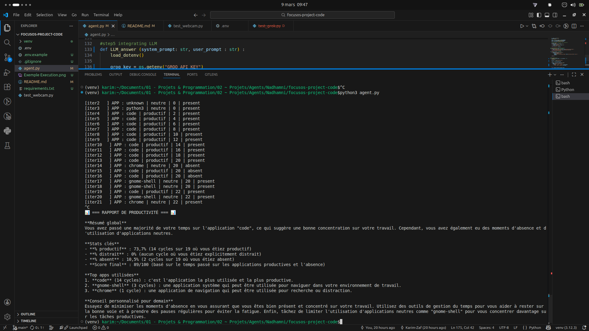

# Nadhamni — AI Productivity Agent

> *"Nadhamni"* means *"Organize me"* in Tunisian Arabic.

An intelligent desktop agent that monitors your activity, detects your presence via webcam, and nudges you back to focus when distractions take over.

Built with **LangGraph** (stateful agent graph), **OpenCV** (computer vision), **Groq** (LLM reports), and **plyer** (desktop notifications).

---

## Architecture

```
┌─────────────┐     ┌─────────────────┐     ┌───────────┐
│ capture_app  │────▶│ check_presence   │────▶│  classify  │
│  (psutil)    │     │   (OpenCV)       │     │(categories)│
└─────────────┘     └─────────────────┘     └─────┬─────┘
       ▲                                          │
       │                                          ▼
┌──────┴──────┐     ┌─────────────────┐     ┌───────────────┐
│  log_wait    │◀───│   send_alert     │◀───│ update_score   │
│  (3s loop)   │    │   (plyer)        │    │  (+2/-3 pts)   │
└─────────────┘     └────────┬────────┘     └───────────────┘
                             │
                     ┌───────┴────────┐
                     │update_distraction│
                     │ (streak counter) │
                     └────────────────┘
```

The graph loops infinitely: after `log_wait`, a **router** sends execution back to `capture_app`.

---

## Demo



---

## Features

- **App Detection** — Captures the most CPU-active process via `psutil`
- **Smart Classification** — Maps apps to `productif` / `neutre` / `distraction`
- **Webcam Presence** — Haar Cascade face + eye detection → `present` / `distracted` / `absent`
- **Dynamic Scoring** — Score evolves based on app category × presence state
- **Distraction Alerts** — Desktop notification after 3+ consecutive distraction cycles
- **AI Evening Report** — Groq LLM generates a productivity summary on session end (Ctrl+C)

### Scoring Matrix

| Presence    | Productif | Distraction |
|-------------|-----------|-------------|
| Present     | +2        | -3          |
| Distracted  | +1        | -3          |
| Absent      | 0         | 0           |

---

## Tech Stack

| Layer           | Tool                  |
|-----------------|-----------------------|
| Agent Graph     | LangGraph (StateGraph)|
| App Detection   | psutil                |
| Computer Vision | OpenCV (Haar Cascade) |
| Notifications   | plyer                 |
| LLM Reports     | Groq (Llama 3.3 70B) |
| Language        | Python 3.12           |

---

## Installation

```bash
# Clone the repo
git clone https://github.com/Karim-Zaf/Nadhamni.git
cd Nadhamni

# Create virtual environment
python3 -m venv venv
source venv/bin/activate

# Install dependencies
pip install -r requirements.txt

# Setup environment
cp .env.example .env
# Edit .env and add your Groq API key (free at console.groq.com)

# Run the agent
python main.py
# Press Ctrl+C to stop and generate AI report
```

> **Note:** Webcam access is required for presence detection.

---

## Project Structure

```
nadhamni/
├── main.py           # Entry point — run this to start the agent
├── graph.py          # LangGraph StateGraph assembly
├── nodes.py          # All agent nodes (capture, classify, score, etc.)
├── config.py         # Categories dictionary + global state
├── test_webcam.py    # Standalone webcam test script
├── requirements.txt  # Python dependencies
├── .env.example      # Environment variables template
├── .gitignore
└── README.md
```

---

## How It Works

1. **capture_app** — Scans running processes, picks highest CPU usage
2. **check_presence** — Opens webcam, runs face + eye detection
3. **classify** — Looks up the app in a category dictionary
4. **update_score** — Adjusts score based on (category × presence)
5. **update_distraction** — Increments or resets the distraction streak
6. **send_alert** — Fires a desktop notification if streak ≥ 3
7. **log_wait** — Prints state to console, waits 3 seconds, loops back

---

## Roadmap

- [x] **Groq AI Evening Report** — Daily productivity summary via LLM
- [ ] **SQLite Persistence** — Store sessions and scores
- [ ] **React Dashboard** — Visualize productivity trends
- [ ] **Browser Tab Detection** — Classify by active tab, not just process
- [ ] **Docker Support** — Containerized deployment

---

## Built For Learning

This project was built as a hands-on way to learn **LangGraph** — from state management and node design to conditional edges and infinite loops. Each feature was added incrementally over 5 days, with a focus on understanding the "why" behind every concept.

---

*Made with focus (and occasional distractions) by Karim*
